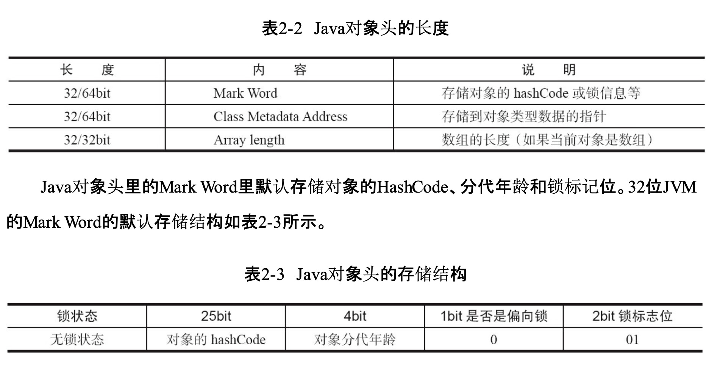
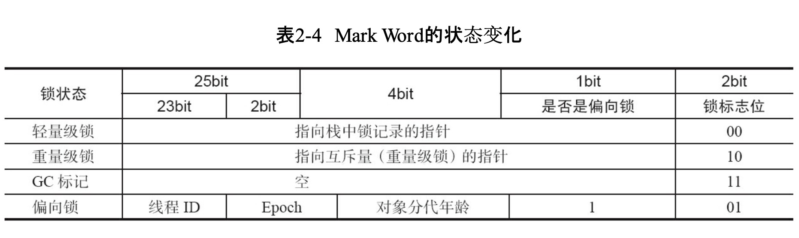
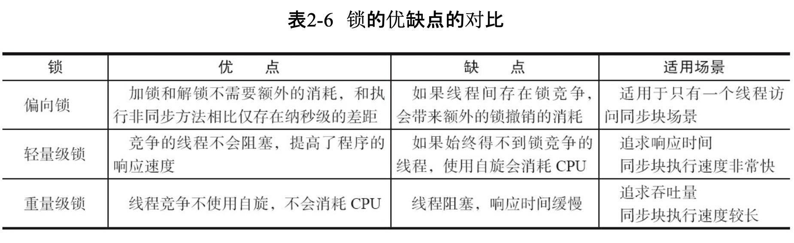

### 锁对象
* 普通同步方法，锁是当前实例对象
* 静态同步方法，锁是当前类的Class对象
* 同步方法块，锁是synchronized括号配置的对象   
  
### java对象头
synchronized用的锁存在java对象头里；  
 

###锁类型
锁升级后不能降级，目的是为了提高获取锁和释放锁的效率      
1. 无锁
2. 偏向锁      
3. 轻量级锁
4. 重量级锁     

###原子操作
1. 总线锁定
2. 缓存锁定
